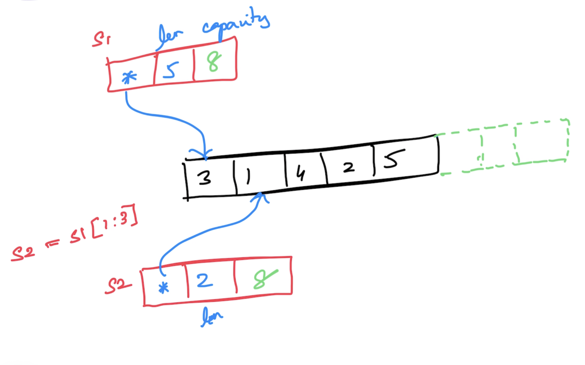

# Go Foundation

## Magesh Kuppan

## Schedule
- Commence      : 9:00 AM
- Tea Break     : 10:40 AM (20 mins)
- Lunch Break   : 12:30 PM (1 hour)
- Tea Break     : 3:00 PM (20 mins)
- Wind up       : 5:00 PM

## Methodology
- No powerpoints
- Discussion & Code

## Repository
- https://github.com/tkmagesh/cisco-go-dec-2023

## Software Requirements
- Go tools (https://go.dev/dl)
- Visual Studio Code (https://code.visualstudio.com)
- Go Extension for Visual Studio Code (https://marketplace.visualstudio.com/items?itemName=golang.Go)
### Verification
- >go version

## Why Go?
- Simplicity
    - ONLY 25 keywords
    - No access modifiers
    - No classes (only structs)
    - No inheritance (only composition)
    - No reference types (everything is a value)
    - No pointer arithmatic
    - No exceptions (only errors)
    - No try..catch..finally
    - No implicit type conversion
- Better Performance
    - Equivalent to C++
    - Close to the hardware (No VM)
        - Compile to machine code targetting the OS
        - Cross compilation is supported 
- Managed Concurrency
    - Light weight (1 goroutine = 4 KB whereas 1 OS Thread = 2 MB)
    - Language support for concurrency
        - go keyword, channel (data type), channel operator ( <- ), range & select case constructs
    - APIs 
        - sync package
        - sync/atomic package

## Hello World

```
//01-hello-world.go

/* package declaration */
package main

/* import dependency packages */

/* package scope type/variable declarations */

/* package init function */

/* main function */
func main() {
	print("Hello World!")
}

/* other functions */
```
To run the program
> go run 01-hello-world.go

To create a build
> go build 01-hello-world.go

> go build -o [binary-name] 01-hello-world.go

### Cross Compilation
To get the environment variables
> go env

> go env GOOS GOARCH

To change the environment variables
> go env -w GOOS=[value] GOARCH=[value]

To get the list of supported platforms
> go tool dist list

To cross compile
> GOOS=windows GOARCH=amd64 go build 01-hello-world.go

## Data Types
- string
- bool

- int8
- int16
- int32
- int64
- int

- uint8
- uint16
- uint32
- uint64
- uint

- float32
- float64

- complex64 (real[float32] + imaginary[float32])
- complex128 (real[float64] + imaginary[float64])

- byte (alias for uint8)
- rune (alias for int32) (unicode code point)

## Variable Declarations
- using "var" keyword
- using ":="

## Scope
- function scope
    - can use ":=" for declaring and initializing variables
    - cannot have unused variables
- package scope
    - cannot use ":=" (use "var" instead)
    - can have unused variables

## Constants
- use "const" keyword
- constants can remain unused (both in function and package scope)

## Constructs
- if else
- for
- switch case

## Functions
- Can have return more than one result
- Variadic functions 
- Anonymous functions
- Higher Order Functions
    - Functions can be assigned as values to variables
    - Functions can be passed as arguments to other functions
    - Functions can be returned as return values from other functions

## Errors
- Errors are just values 
- Errors are not "thrown" but returned
- Typically, errors are objects implementing "error" interface
    - Error() method
- Create errors
    - errors.New()
    - fmt.Errorf()

## Collection
- Array
    - fixed sized typed collection
    - Members can be accessed using indexer
- Slice
    - varying sized typed collection
    - pointer to an underlying array
    - append() - to add new items
    - len() - # of values that can be accessed from the underlying array through the slice
    - cap() - memory initialized + memory uninitialized(only allocated)


- Map
    - typed collection of key/value pairs